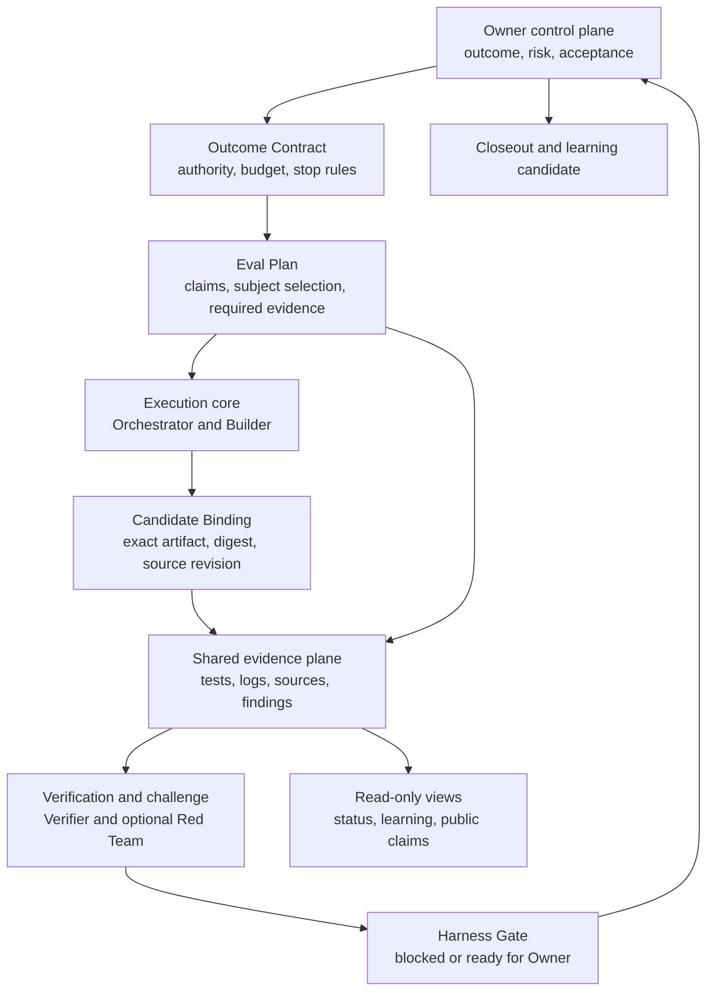

# GDAC v2.0 Harness Architecture

Status: normative Harness architecture for GDAC v2.0, Owner-authorized and
published on 2026-08-08.

## What the Harness is

The GDAC Harness is a portable control layer around Codex, Claude, or another
software Agent. It does not replace the Agent runtime. It defines how work
enters, what an Agent may change, which records must survive the session, how
claims are evaluated, when work must stop, and what evidence reaches the Owner.

The architecture keeps the useful system mechanics from GDAC v1.3 while
removing the idea that every project needs an AI company with standing offices.
Roles are temporary responsibilities. Models and tools may change. Contracts,
authority, evidence, records, and decision responsibility must persist.

The current repository ships this specification, the Eval Rules, schemas,
templates, validators, and worked examples. It does not ship an Agent runner,
attempt-ledger service, gate service, sandbox, or deployment system.

## Design goals

The Harness is designed to make delegated software work:

- bounded by an outcome, authority, budget, and stop conditions;
- reviewable from a frozen artifact and original records;
- evaluated against claims and evidence defined before implementation;
- portable across Agent platforms through common artifacts;
- economical in context, retries, roles, and evaluation effort; and
- unable to convert missing required evidence into a technical pass.

These are design goals. They are not evidence of adoption or effectiveness.
A separately declared Owner decision may resolve a reserved business or risk
question. It cannot relabel a failed or unevaluated technical claim.

## System at a glance

The two central paths stay separate:

1. The execution path may change the governed artifact within declared scope.
2. The evaluation path may inspect, test, challenge, and block. It may not
   rewrite the artifact or accept it for the Owner.

## Minimum implementation functions

A minimum useful implementation needs the following logical functions. They do
not require separate services or processes.

1. **Contract validator:** checks outcome, non-goals, authority, budgets, stop
   rules, and Eval Plan completeness.
2. **Attempt ledger and budget meter:** records material events, snapshots,
   unresolved items, and resource use across the entire task.
3. **Evidence interface:** accepts grader output in a common evidence record
   bound to a claim or risk and the Candidate Binding.
4. **Gate engine:** reads stored eval results and applies the declared
   aggregation rules without modifying the inputs or making the Owner decision.
5. **Owner disposition recorder:** binds an Owner decision to the exact
   contract, candidate, and gate result.

Adapters, dashboards, model calls, Agent hosting, databases, and deployment are
outside this minimum core.

## Connected architecture

### Owner control plane

The Owner defines why the work exists, what outcome counts, which risks are
acceptable, and which decisions remain human. The Owner may accept, accept with
conditions, request rework, pause, stop, deploy, or publish.

The Owner may delegate implementation. The Owner does not delegate final
accountability by assigning work to an Agent. Before recording a disposition,
the Owner reviews the material assumptions, unresolved unknowns, conditions,
and remaining risk in the decision package.

### Execution core

The execution core is the only path that may modify the governed artifact. An
Orchestrator may prepare bounded task packets and coordinate dependencies. A
Builder implements the smallest change that satisfies the frozen contract.

The execution core may:

- plan and implement inside declared scope;
- create temporary research, testing, or security tasks;
- run self-checks and repair ordinary defects;
- record attempts, failures, diffs, and handoff material; and
- escalate when the work needs more authority or budget.

It may not:

- expand its scope, permissions, budget, retries, or Agent depth;
- weaken or silently replace the frozen acceptance criteria or Eval Plan;
- hide failed attempts or overwrite material decision history; or
- approve its own final delivery.

### Shared record and evidence plane

Every role judges the same versioned records instead of relying on a retelling
by the Builder. The minimum record set is:

- Outcome Contract, including Owner intent, authority, budget, and stop rules;
- Eval Plan, including the pre-build subject-selection rule;
- Attempt Record, including the task packet, actions, failures, and usage;
- Candidate Binding, which identifies the exact artifact, digest, source
  revision, and attempt under review;
- Evidence Bundle, including raw results, findings, and the Harness Gate result;
  and
- Owner Disposition and Closeout, including conditions, retained work, and any
  learning candidate.

Summaries may be rewritten to reduce reading effort. They may not replace or
delete the original contract, artifact, tests, logs, findings, or decision.
Material decisions retain context, alternatives, disagreement, authority, and
the reason for later revision.

### Verification and challenge

Verification asks whether the frozen criteria are supported by their required
evidence. Challenge actively searches for missing assumptions, scope overreach,
abuse paths, abnormal inputs, unsupported conclusions, and evidence gaps.

A Verifier or Red Team:

- reads the frozen artifact, Eval Plan, and original records;
- produces test results, findings, limitations, and unknowns;
- may block a positive transition when required evidence is missing; and
- may not change the artifact or redefine success after seeing the result.

One model may perform more than one responsibility in separate contexts when
the task permits it. The reviewer does not inherit the Builder's hidden
reasoning or conclusion. That is context separation. It is not organizational
independence, third-party assurance, or internal audit.

### Decision, views, and learning

The Harness Gate derives only whether the candidate is `blocked` or `ready`.
The Owner then records a separate disposition. That disposition is not another
gate: technical aggregation and accountable acceptance are different state
changes.

Read-only views may project the shared records for three purposes:

- Owner view: status, change, risk, blockers, and decisions required;
- learning view: failures, corrections, proposed preventive checks; and
- public view: claims, examples, and limits supported by the record.

Views may compress and reorganize records. They may not modify the artifact,
rewrite original evidence, or present a plan or inference as a completed fact.

### Controlled learning

A failed or completed task may propose a learning candidate. The candidate
records the triggering event, current baseline, proposed rule, one observable
difference, prospective decision rule, preventive check, expected burden,
applicability boundary, and required Owner authority.

The lifecycle is `candidate -> validated -> active -> retired`. `Validated`
means that a preregistered comparison was run against a stated baseline, its
source evidence and counterexamples were retained, the decision rule was met,
the added burden was measured, and scope and expiry were recorded. It does not
mean active. Activation additionally requires an Owner authorization reference
and an explicit project or cross-project scope. An Agent may propose and test a
candidate; it may never authorize activation. New projects retrieve only the
three to five active learnings most relevant to their task and risk, not the
full learning history.

## Responsibilities and authority

| Responsibility | May do | May not do |
|---|---|---|
| Owner | Freeze outcome, risk, authority, and acceptance. Review material assumptions, unknowns, and remaining risk. Make final, release, and publication decisions. | Treat required missing evidence as a technical pass, accept work without acknowledging unresolved items, or transfer accountability to an Agent. |
| Orchestrator | Create bounded task packets, allocate context and budget, enforce dependencies and stop rules. | Expand scope, permissions, budget, acceptance, or its own authority. |
| Builder | Modify declared objects, test the change, and record implementation evidence. | Write outside scope, weaken the Eval Plan, review its own final claim, or declare acceptance. |
| Verifier | Run frozen acceptance, capability, and regression checks against the exact snapshot. | Modify the implementation, replace required evidence, or redefine success. |
| Red Team | Challenge assumptions, edge cases, abuse paths, and evidence sufficiency without inheriting the Builder's reasoning. | Claim third-party independence when it does not exist or make the Owner decision. |
| Integrator | Reconcile the frozen artifact, evidence, findings, and handoff after required gates. | Merge blocked work, suppress findings, or change a failed gate into a pass. |

Small tasks may combine responsibilities in fewer people or Agents. The write
boundary, separated review context, evidence, and Owner-reserved decisions must
remain explicit.

No role may create its own authority. Every material state change must trace to
a declared permission and sufficient evidence.

## Non-negotiable rules

- Freeze the Outcome Contract and the Eval Plan, including its subject-selection
  rule, before implementation output is evaluated.
- Deny undeclared writes, external actions, role expansion, and authority by
  default.
- Trace every material criterion through
  `claim -> eval -> grader -> evidence -> gate -> Owner disposition`.
- Bind the frozen Eval Plan to one exact candidate after implementation. A
  changed contract, plan, candidate, or relevant procedure creates a new
  version and every affected required eval must run again.
- Require every mandatory evidence item. An aggregate score cannot hide a
  missing or failed item.
- Let the Builder self-check, but do not treat its non-deterministic judgment as
  review performed without the Builder's reasoning.
- Count Builder, child Agent, Verifier, Red Team, and rerun usage against the
  budget for the entire task.
- Preserve prior contracts, candidates, attempts, findings, eval results, gate
  states, and decisions when a revision creates a new version.

## Required record chain

| Artifact | Purpose | Produced by | Gate effect |
|---|---|---|---|
| Outcome Contract | Captures Owner intent and freezes the result, non-goals, authority, task limits, budget, stop rules, and acceptance. | Owner or delegated author, frozen by Owner | Required before execution. |
| Eval Plan | Freezes claims, subject-selection rules, graders, pass rules, required evidence, producer constraints, retries, and retention. | Owner, Verifier, or declared evaluator | Required before implementation of material work. |
| Attempt Record | Preserves the task packet, actions, failures, repairs, usage, and order of events. | Execution core | Supports budget and stop-rule enforcement. |
| Candidate Binding | Resolves the selection rule to the exact artifact, digest, source revision, and attempt under review. | Builder or Integrator | Creates the immutable subject binding; a changed artifact requires a new binding. |
| Gate Record | Binds attempts, stable evidence references and digests, eval results, contradictions, findings, and the derived Harness Gate state to that candidate. | Verifier, Red Team, Integrator, and deterministic aggregator | Returns `blocked` or `ready`. It cannot create acceptance. |
| Owner Disposition and Closeout | Records the Owner decision, conditions, remaining risk, retained work, prohibited claims, and any learning candidate. | Owner, with a prepared handoff | Authorizes the next or final workflow action. It cannot rewrite a technical result. |

Four objects that are often conflated have distinct jobs:

- a **Snapshot** is a captured state and may be supporting evidence;
- a **Candidate Binding** names the exact object being evaluated;
- **Evidence** records an observation, test, review, or source about that bound
  object; and
- a **Gate Result** is the deterministic aggregation of declared eval states
  and open material findings.

A snapshot is not automatically a binding, evidence does not decide acceptance,
and a Gate Result does not become an Owner disposition.

## Enforcement locus

| Rule | Enforced by | What happens on violation |
|---|---|---|
| Required fields, enums, IDs, digests, evidence types, and declared budgets | JSON Schema and deterministic validators | Record is invalid; frozen work cannot proceed. |
| Candidate/evidence binding, fail-closed truth table, blocking aggregation, and accepting-disposition precondition | Gate Record validator | Harness Gate remains `blocked`; an accepting disposition is rejected. |
| Write scope, actual principal identity, sandbox boundary, secrets, and external actions | Agent platform, repository controls, CI, and execution environment | Harness records the boundary, but enforcement requires the named external control. |
| Materiality, risk-tier selection, grader competence, residual risk, and final acceptance | Verifier and accountable Owner | Human judgment is recorded with authority and evidence; it is not automated away. |

This distinction prevents a validator from being presented as an execution
sandbox or an Owner identity system.

## State model

The Harness keeps technical evaluation, gate aggregation, and accountable
decision-making separate:

- A technical eval returns one of `pass`, `fail`,
  `insufficient_evidence`, or `not_evaluated`.
- The Harness Gate derives one of `blocked` or `ready`.
- The Owner records one disposition: `accept`,
  `accept_with_conditions`, `rework`, `pause`, or `stop`.

Required transition rules:

1. Execution requires a frozen Outcome Contract and applicable Eval Plan.
2. The pre-build Eval Plan selects the subject by rule. After implementation,
   the Candidate Binding identifies the exact version under review.
3. A required `fail`, `insufficient_evidence`, or
   `not_evaluated` result makes the current candidate `blocked`.
4. Only `ready` may lead to `accept` or
   `accept_with_conditions`. Conditions may cover disclosed residual
   risk or non-mandatory findings; they may not carry a failed or missing
   mandatory eval.
5. A blocked candidate may lead to `rework`, `pause`, or
   `stop`. Rework creates a new attempt and Candidate Binding without
   overwriting the failed one.
6. Changing the contract, Eval Plan, candidate, pass rule, or relevant procedure
   creates a new version, preserves the old result, and reruns every affected
   required eval.

## Risk-based loading

Use the smallest control set that covers the material risk. The Outcome
Contract selects one base tier (`low`, `medium`, or `high`) and zero or more
independent overlays such as `security`, `privacy`, or `regulated`. The tier
sets review intensity; an overlay adds specialist evidence without relabelling
the base tier. [EVAL_RULES.md](./EVAL_RULES.md) defines the minimum profile. A
project may strengthen it. A weaker profile requires a recorded Owner rationale
and is not equivalent evidence. A regulated overlay maps evidence and flags
legal questions; it cannot certify compliance.

## Context, token, and retry economy

The Harness treats context and retries as governed resources:

- retrieve progressively instead of loading the whole repository;
- give each responsibility only the context and authority it needs;
- checkpoint before the task context becomes ambiguous or expensive;
- define time, token, build-retry, evaluator-rerun, trial, and Agent-depth
  budgets before execution;
- preserve every material retry as a separate attempt;
- stop when the same blocker repeats or a budget is exhausted; and
- record tokens per accepted outcome only when usage and Owner acceptance are
  both observable, segmented by task type, risk, and rework.

Tokens per accepted outcome is a diagnostic, not an optimization target. A low
number can reflect under-testing or an easy task; a high number can reflect
material risk, necessary challenge, or avoidable rework. Never trade required
evidence for a better ratio.

Evaluation effort must cover a material claim or risk. More graders, roles, and
test volume are not automatically better.

## Engineering quality gates

Implementation begins from acceptance criteria and uses the smallest change
that satisfies them. Apply, as relevant:

- capability and regression tests;
- type and lint checks;
- security and privacy checks;
- adversarial cases;
- documented clean-environment verification; and
- an evidence bundle bound to the tested snapshot.

Do not add a role, artifact, abstraction, or gate unless it introduces a new
evidence source, necessary expertise, materially different challenge, or a
control that changes authority, state, or a decision.

## Minimum useful setup

Start with one real task:

1. Freeze one Outcome Contract and one Eval Plan.
2. Give one Builder only the write access it needs.
3. Run deterministic acceptance and regression checks.
4. Review the frozen snapshot and original evidence without inheriting the
   Builder's reasoning.
5. Produce a Harness Gate result with failures, limits, and unknowns.
6. Record the Owner decision.
7. Close the task and preserve any learning candidate without activating it.

This is enough to use the architecture. A project does not need every optional
role or view.

## Optional extensions

Add these only when the task needs them:

- Codex, Claude, or other platform adapters;
- a separate Orchestrator or Integrator;
- parallel Builders or evaluators;
- model graders;
- dashboards and static reports;
- Owner, learning, or public read-only views;
- cross-project learning retrieval;
- a regulated-environment evidence overlay;
- persistent databases, remote APIs, or event streams;
- digital signatures and identity systems;
- operating-system sandbox and secrets management; or
- automated deployment or publication.

An extension may present or summarize the source records. It may not weaken
authority, invent evidence, change a fact into an inference, turn missing
evidence into a claim, or turn a blocked gate into a pass.

## Evidence boundary

GDAC is an author-maintained Harness architecture and evaluation rule set
developed with AI assistance. Repository tests can show that stated schemas,
validators, and example controls behave as recorded on the declared cases.
They do not establish external adoption, production effectiveness, independent
assurance, organizational value, reduced risk, lower cost, or legal compliance.

Current practice observations include private author-run projects that outside
readers cannot independently inspect. No independent third party has replicated
the method or validated improved delivery, safety, cost, or governance outcomes.
